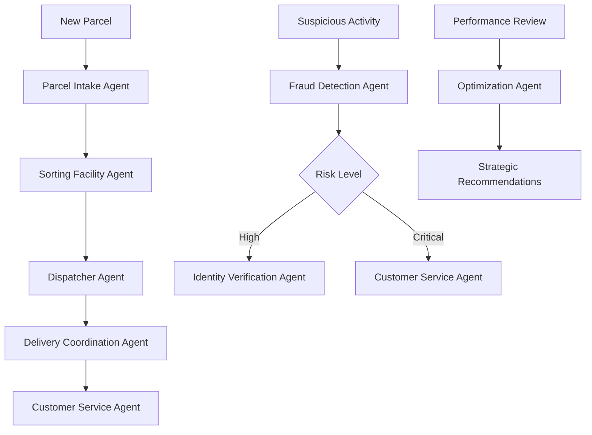

# Agent Skills Documentation

This directory contains comprehensive skills documentation for all 9 AI agents in the Zava Logistics system.

## 📂 Directory Structure (Centralized)

```
Agent-Skills/
├── README.md (this file)
├── customer-service/
│   ├── SKILLS.md (capabilities documentation)
│   └── system-prompt.md (agent instructions - SINGLE SOURCE OF TRUTH)
├── fraud-detection/
│   ├── SKILLS.md
│   └── system-prompt.md
├── identity-verification/
│   ├── SKILLS.md
│   └── system-prompt.md
├── dispatcher/
│   ├── SKILLS.md
│   └── system-prompt.md
├── parcel-intake/
│   ├── SKILLS.md
│   └── system-prompt.md
├── sorting-facility/
│   ├── SKILLS.md
│   └── system-prompt.md
├── delivery-coordination/
│   ├── SKILLS.md
│   └── system-prompt.md
├── optimization/
│   ├── SKILLS.md
│   └── system-prompt.md
└── driver/
    ├── SKILLS.md
    └── system-prompt.md
```

## ✨ New Centralized System Prompt Management

**IMPORTANT:** Agent system prompts are now managed in `system-prompt.md` files within each agent folder. This is the **SINGLE SOURCE OF TRUTH** for all agent instructions.

### How It Works

```python
# Scripts/recreate_agents.py reads from system-prompt.md files:
def load_agent_instructions(agent_folder: str) -> str:
    """Load agent system prompt from Agent-Skills/{agent_folder}/system-prompt.md"""
    # Reads from file instead of hardcoded strings
```

### Benefits

✅ **Single Source of Truth** - One location per agent for instructions  
✅ **Easy Updates** - Change prompts without editing code  
✅ **Version Control** - Track prompt changes in Git  
✅ **No Conflicts** - Eliminates duplicate instructions  
✅ **Better Organization** - Skills docs + prompts together  

### Updating Agent Instructions

**To update an agent's behavior:**

1. Edit the `system-prompt.md` file in the agent's folder
2. Run `python Scripts/recreate_agents.py` to update Azure AI agents

**Example:**
```bash
# Update Customer Service agent behavior
code Agent-Skills/customer-service/system-prompt.md
# Make your changes, save
python Scripts/recreate_agents.py
```

## Quick Reference

| Agent | Purpose | Skills File | System Prompt |
|-------|---------|-------------|---------------|
| **Customer Service** | Real-time customer inquiries and tracking | [SKILLS.md](customer-service/SKILLS.md) | [system-prompt.md](customer-service/system-prompt.md) |
| **Fraud Detection** | Security threat analysis and scam detection | [SKILLS.md](fraud-detection/SKILLS.md) | [system-prompt.md](fraud-detection/system-prompt.md) |
| **Identity Verification** | Customer identity verification for high-risk cases | [SKILLS.md](identity-verification/SKILLS.md) | [system-prompt.md](identity-verification/system-prompt.md) |
| **Dispatcher** | Intelligent parcel-to-driver assignment | [SKILLS.md](dispatcher/SKILLS.md) | [system-prompt.md](dispatcher/system-prompt.md) |
| **Parcel Intake** | New parcel validation and recommendations | [SKILLS.md](parcel-intake/SKILLS.md) | [system-prompt.md](parcel-intake/system-prompt.md) |
| **Sorting Facility** | Facility capacity monitoring and routing | [SKILLS.md](sorting-facility/SKILLS.md) | [system-prompt.md](sorting-facility/system-prompt.md) |
| **Delivery Coordination** | Multi-stop delivery sequencing and notifications | [SKILLS.md](delivery-coordination/SKILLS.md) | [system-prompt.md](delivery-coordination/system-prompt.md) |
| **Optimization** | Network-wide performance analysis and cost reduction | [SKILLS.md](optimization/SKILLS.md) | [system-prompt.md](optimization/system-prompt.md) |
| **Driver** | Real-time driver assistance and delivery support | [SKILLS.md](driver/SKILLS.md) | [system-prompt.md](driver/system-prompt.md) |

## Documentation Standards

Each agent folder contains TWO files:

### 1. SKILLS.md - Capabilities Documentation
- Agent overview and purpose
- Core capabilities
- Configuration requirements
- Usage examples with code
- Response formats
- Integration points
- Prompt engineering guidelines
- Performance metrics
- Testing scenarios
- Troubleshooting
- Best practices
- Version history

### 2. system-prompt.md - Agent Instructions (SINGLE SOURCE OF TRUTH)
- Role definition
- Key responsibilities
- Decision-making frameworks
- Output requirements
- Response style guidelines
- Special handling instructions
- Used by: Scripts/recreate_agents.py

## Agent Instructions File Structure

Each `system-prompt.md` follows this template:

```markdown
# Role
You are a [Agent Name] responsible for [primary purpose].

# Key Responsibilities
- Responsibility 1
- Responsibility 2
- ...

# Decision Framework
[Decision-making logic and rules]

# Output Requirements
[Expected format and content]

# Response Style
[Tone, formatting, and communication guidelines]

# Special Instructions
[Edge cases, constraints, and best practices]
```

**Examples:**
- [customer-service/system-prompt.md](customer-service/system-prompt.md) - 40 lines with tool usage guidelines
- [fraud-detection/system-prompt.md](fraud-detection/system-prompt.md) - 60 lines with risk thresholds
- [dispatcher/system-prompt.md](dispatcher/system-prompt.md) - 70 lines with geographic clustering logic

---

## SKILLS.md Documentation Structure

Each SKILLS.md file follows industry best practices with these standard sections:

### 1. Agent Overview
- Purpose statement
- Agent type classification
- Model information
- Environment variable configuration

### 2. Core Capabilities
- Primary functions
- Key features
- Use case scenarios
- Capability boundaries

### 3. Configuration
- Environment variables
- External integrations
- Dependencies
- Authentication requirements

### 4. Usage Examples
- Code examples with expected outputs
- Common usage patterns
- Integration examples
- Error handling scenarios

### 5. Response Format
- Standard JSON response structure
- Field descriptions
- Example responses
- Status codes

### 6. Integration Points
- Web application routes
- API endpoints
- Database interactions
- External service connections

### 7. Prompt Engineering
- Instruction frameworks
- Analysis methodologies
- Decision-making logic
- Quality assurance approaches

### 8. Performance Metrics
- Target response times
- Accuracy expectations
- Success criteria
- Quality indicators

### 9. Testing
- Test scenarios
- Expected outcomes
- Integration tests
- Performance tests

### 10. Troubleshooting
- Common issues
- Diagnostic commands
- Resolution steps
- Support escalation

### 11. Best Practices
- Usage recommendations
- Integration guidelines
- Optimization tips
- Security considerations

### 12. Version History
- Update chronology
- Feature additions
- Bug fixes
- Breaking changes

## Agent Interaction Workflows

### Multi-Agent Workflows



### Security Workflow

```
Fraud Detection (≥85% risk)
    ↓
Identity Verification (request verification)
    ↓
Customer Service (send notification)
    ↓
System (hold parcel if ≥90% risk)
```

### Delivery Workflow

```
Parcel Intake (validate parcel)
    ↓
Sorting Facility (assign to facility)
    ↓
Dispatcher (assign to driver)
    ↓
Delivery Coordination (optimize route)
    ↓
Customer Service (track & support)
```

## Environment Variables Reference

All agents require these shared environment variables:

```bash
# Azure AI Foundry Connection
AZURE_AI_PROJECT_CONNECTION_STRING="host;sub;rg;project"
AZURE_AI_MODEL_DEPLOYMENT_NAME="gpt-4o"

# Agent IDs (one per agent)
CUSTOMER_SERVICE_AGENT_ID="asst_XXX"
FRAUD_RISK_AGENT_ID="asst_XXX"
IDENTITY_AGENT_ID="asst_XXX"
DISPATCHER_AGENT_ID="asst_XXX"
PARCEL_INTAKE_AGENT_ID="asst_XXX"
SORTING_FACILITY_AGENT_ID="asst_XXX"
DELIVERY_COORDINATION_AGENT_ID="asst_XXX"
OPTIMIZATION_AGENT_ID="asst_XXX"
DRIVER_AGENT_ID="asst_XXX"
```

## Quick Start Guide

### 1. Setup Environment
```bash
# Copy from example
cp .env.example .env

# Configure Azure connection
# Edit .env with your Azure credentials
```

### 2. Create Agents
```bash
# Automated agent creation
python Scripts/recreate_agents.py

# This will populate agent IDs in .env automatically
```

### 3. Test Individual Agent
```python
from agents.base import customer_service_agent

result = await customer_service_agent({
    'details': 'Track parcel LP123456',
    'public_mode': True
})

print(result['response'])
```

### 4. Explore Skills Documentation
```bash
# Read agent-specific documentation
cat docs/agents/customer-service/SKILLS.md
```

## Common Integration Patterns

### 1. Web API Integration
```python
@app.route('/api/agent/invoke', methods=['POST'])
async def invoke_agent():
    data = request.get_json()
    agent_type = data.get('agent_type')
    
    if agent_type == 'customer_service':
        result = await customer_service_agent(data)
    elif agent_type == 'dispatcher':
        result = await dispatcher_agent(data)
    # ... other agents
    
    return jsonify(result)
```

### 2. Background Task Processing
```python
async def process_daily_assignments():
    """Run dispatcher agent for all locations"""
    locations = ['Sydney', 'Melbourne', 'Brisbane']
    
    for location in locations:
        result = await dispatcher_agent({
            'action': 'auto_assign',
            'location': location,
            'date': date.today()
        })
        
        await save_assignments(result)
```

### 3. Event-Driven Workflows
```python
@app.event('fraud_detected')
async def on_fraud_detected(event):
    """Trigger verification when fraud detected"""
    if event.risk_score >= 85:
        await identity_agent({
            'customer_name': event.customer_name,
            'verification_reason': 'High fraud risk',
            'risk_score': event.risk_score
        })
```

## Performance Monitoring

Monitor agent performance through:

- **Azure Application Insights:** Response times, error rates
- **Cosmos DB Metrics:** Query performance, RU consumption
- **Custom Logs:** Agent-specific metrics and decisions
- **Admin Dashboard:** Real-time agent status and performance

### Key Metrics to Track

| Metric | Target | Alert Threshold |
|--------|--------|----------------|
| Response Time | < 2s | > 5s |
| Success Rate | > 95% | < 90% |
| RU Consumption | < 1000/min | > 2000/min |
| Customer Satisfaction | > 4.5/5 | < 4.0/5 |

## Getting Help

### Documentation Resources
- **Main Documentation:** [AGENTS.md](../../AGENTS.md)
- **Deployment Guide:** [Guides/AZURE_DEPLOYMENT.md](../../Guides/AZURE_DEPLOYMENT.md)
- **Demo Guide:** [Guides/DEMO_GUIDE.md](../../Guides/DEMO_GUIDE.md)

### Support Contacts
- **Technical Issues:** Review Troubleshooting section in each SKILLS.md
- **Agent Behavior:** Check Prompt Engineering sections
- **Integration Questions:** Review Integration Points sections

### Community & Contributions
- Submit issues via Azure DevOps
- Contribute improvements via pull requests
- Share learnings and best practices

## Maintenance & Updates

### Regular Maintenance Tasks

1. **Monthly:** Review agent performance metrics
2. **Quarterly:** Update skills documentation for changes
3. **Annually:** Comprehensive agent instruction review
4. **As Needed:** Prompt engineering improvements

### Documentation Update Process

1. Identify change or improvement
2. Update relevant SKILLS.md file
3. Update this README if structure changes
4. Update main AGENTS.md for cross-cutting changes
5. Test documentation accuracy
6. Commit with descriptive message

## Version Information

- **Documentation Format Version:** 1.0
- **Agent Framework:** Azure AI Foundry (Microsoft Agent Framework)
- **Last Updated:** March 17, 2026
- **Maintained By:** Zava Logistics Team

---

*This documentation follows industry best practices for AI agent documentation, including comprehensive capability descriptions, usage examples, integration patterns, and troubleshooting guidance.*
