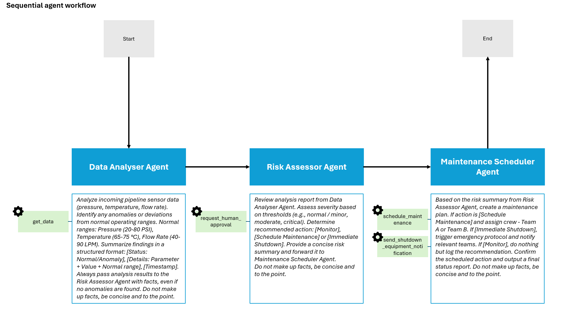
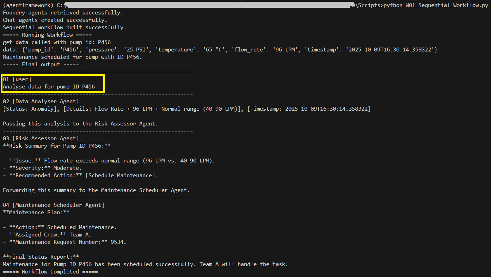
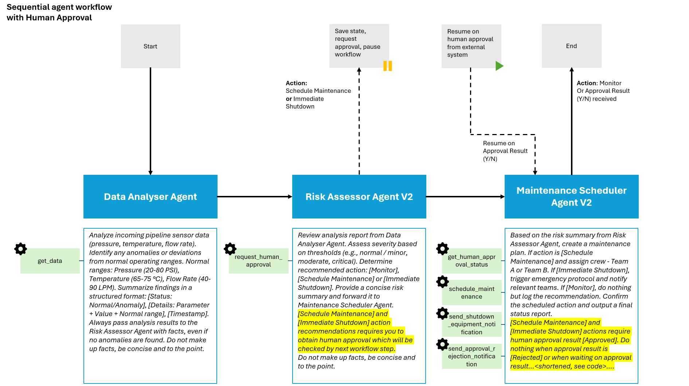

### About

The scipts directory contains examples of creating, running agents and workflows using the Microsoft [Agent Framework](https://learn.microsoft.com/en-us/agent-framework/overview/agent-framework-overview).

**Agents**

- A01_Create_Single_Foundry_Agent.py - Create a single Foundry agent with tool use capability.
- A02_Create_Single_Foundry_Agent_Persistent.py - Create a persistent Foundry agent with tool use capability. You can see the agent in the Azure AI Foundry.
- A03_Create_Multiple_Foundry_Agent_Persistent.py - Create multiple persistent Foundry agents with tool use capability. You can see the agents in the Azure AI Foundry.

**Workflows**

- W01_Sequential_Workflow.py - Create and run a sequential workflow of the persistent Foundry agents created in A03_Create_Multiple_Foundry_Agent_Persistent.py
- W02_Handoff_Workflow.py - Create and run a handoff workflow (PENDING: Not yet supported in Python SDK)
- W03_Magentic_Workflow.py - Create and run a magentic workflow of the persistent Foundry agents created in A03_Create_Multiple_Foundry_Agent_Persistent.py
- W04_Sequential_Workflow_Human_Approval.py - Create and run a sequential workflow of the persistent Foundry agents with human approval for critical actions, implemented using workflow checkpointing. To APPROVE / REJECT, update the approval_db.json which simulates external system / database / API. The Maintenance Scheduler Agent will wait until approval decision is available (via approval_db.json)

The conversation history is saved in Azure AI Foundry under _Threads_.

_requirements.txt_ and _env_ sample files are included.

